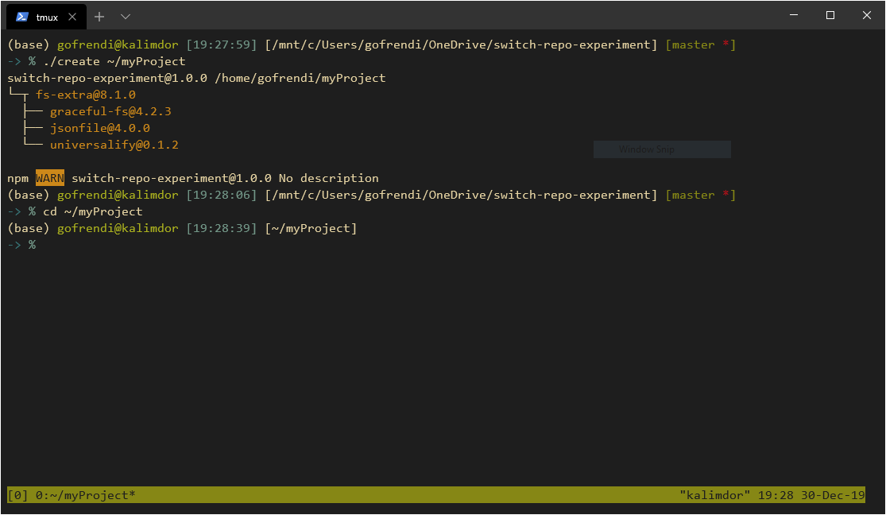
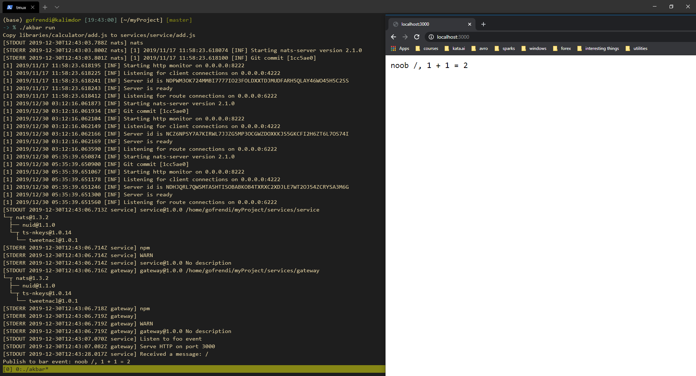

# Switch Repo (aka: Akbar)

Embrace monorepo without abandon multi-repo

```
multi-repos --> mono-repo --> multi-repos
(pull)          (coding)      (push back)
```

# Problem

You already have multi repos. You know that switching to mono-repo could give you some advantages. You believe monorepo is easier to manage. You want to do code-review in a single PR, not multiple of them. But you are afraid to fully embrace mono-repo since some of your repos are private. Thus, you don't want to publish everything into a single mono-repo.

__TL;DR__ : You want monorepo, you don't want to abandon multi-repo, and you have a very good reason for that.

# Demo

## Clone this repo

```sh
git clone git@github.com:goFrendiAsgard/switch-repo-experiment.git ~/akbar
```

## Create an empty project

```sh
# create project
cd ~/akbar
./create ~/myProject

# change directory to the newly created project
cd ~/myProject
```



## Add origin

After creating an empty project in your computer, you should make a remote repository on your git server and link it to your newly created project:

```sh
git remote add origin git@github.com:<your-user>/<your-repo>.git
```

## Fork multi-repo example

Open github and fork the following repositories:

```
https://github.com/goFrendiAsgard/switch-repo-service
https://github.com/goFrendiAsgard/switch-repo-gateway
```

## Create configuration

```sh
vim ./config.json # or code ./config.json
```

Right now, the configuration might looks like this:

```yaml
environments:
  general: {}
  services: {}

components: {}

executions: []
```

Now, edit your configuration to match this:

```yaml
environments:
  general:
    # The following environments will be applied to every service on runtime:
    natsUrl: nats://nats.io:4222
    getMessageEvent: foo
    sendMessageEvent: bar

  services:
    gateway:
      # gateway specific environment
      port: 3000
    service:
      # service specific environment
      message: noob


components:

  # a library
  calculator:
    type: library
    location: "./libraries/calculator"

  # gateway service
  gateway:
    type: service
    # TODO: adjust the origin to match yours
    origin: git@github.com:goFrendiAsgard/switch-repo-gateway.git
    branch: master
    location: "./services/gateway"
    start: npm install && node start

  # our core service, unfortunately the name is also "service" :(
  service:
    type: service
    # TODO: adjust the origin to match yours
    origin: git@github.com:goFrendiAsgard/switch-repo-service.git
    branch: master
    location: "./services/service"
    links:
      # this service is depend on calculator library.
      calculator:
        from: "./add.js"
        to: "./add.js"
    start: npm install && node start

  # docker container for nats
  nats:
    type: container
    run: docker run --name nats -p 4222:4222 -p 6222:6222 -p 8222:8222 -d nats
    containerName: nats


executions:
  # execution order
  - nats
  - service
  - gateway
```

Please make sure you've edit your service's origins (See the TODO comments of the configuration).

## Create library

Library is reusable component that can be shared among services. Let's make one.

```sh
mkdir -p ./libraries/calculator
vim ./libraries/calculator/add.js # or code ./libraries/calculator/add.js
```

```javascript
// this is the content of `add.js`
module.exports = (a, b) => a + b;
```

## Pull the multi-repos

Now, eveerything is ready. Time to fetch some codes from your multi-repos:

```sh
./akbar pull
```


##  Run all services as one

Finally, you can run your services with a single command:

```sh
./akbar run
```



## Develop as single monorepo

Since your project is now a single monorepo, you can perform any valid git operation here. For example, you can make a new branch, do some commit, and submit pull request.

## Push to multi-repos

Once ready, you can push every changes you have made into multi-repos:

```sh
./akbar push
```


# Switching from mono-repo to multi-repos and back

At any point, you can perform `./akbar split` to switch from mono-repo to multi-repo or `./akbar join` to do the opossite.